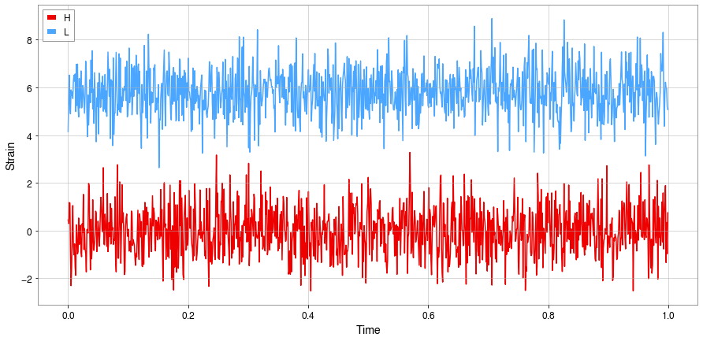

Generators Tutorial
===================

.. _tutorials.generator:

In this tutorial we will go through the two main objects of MLy DataPod and DataSet and how we can use them to organise our data instances to python objects that carry their metadata to the final datasets with ease.

DataPod
-------

DataPod is an object to consentrate all the information of a data instance. The reason for their creation is to encapsulate all the usefull attributes an instance need to carry. As this packages is focused on the generation of gravitational wave signals, datapods have as the main data information to be the strain timeseries.

To create a simple DataPod we only have to pass timeseries data as an input. In the following example we will just generate random gaussian noise with ``numpy``, and then assign a detector to each timeseries.

.. code-block:: python

    timeseries1 = numpy.random.randn(1*1024)
    timeseries2 = numpy.random.randn(1*1024)
    sample_frequency=1024

    pod = DataPod( strain = [ timeseries1 , timeseries2 ]
                  , labels = {'type':'noise' }
                  , fs = sample_frequency
                  , detectors=['H','L'])
                  
To visualize what data the DataPod has we can use the ``.plot()`` method:          
                
.. code-block:: python

    pod.plot()
    

                  
As you can see the LIGO and Virgo detectors have a built in 